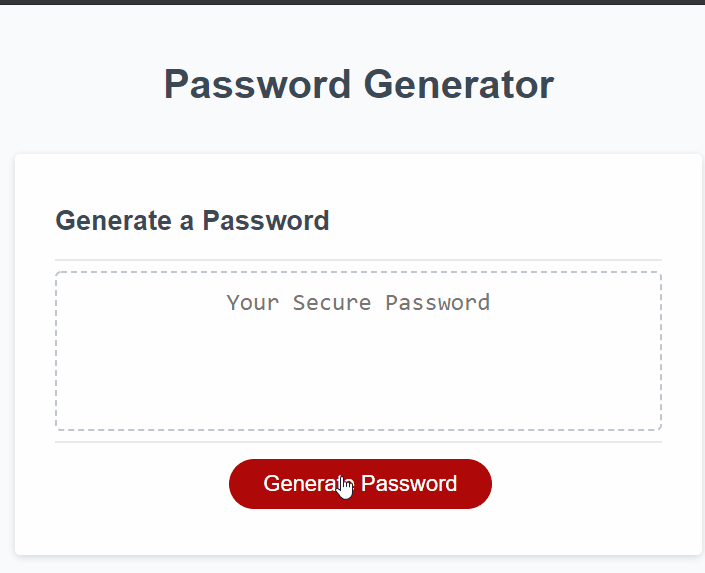

(Note: this branch is to archive the original version of this assignment as it was turned in. It got better.)

# PasswordGenerator
Third homework assignment for uw-sea-fsf-pt-08-2020-u-c, [a basic Javascript program to generate randomized passwords.][1]

## Table of Contents

* [Description](#description)
  * [Building the Deck](#building-the-deck)
  * [Dealing the Hand](#dealing-the-hand)
  * [Checking the Work](#checking-the-work)
  * [Future Changes](#future-changes)
  * [Built With](#built-with)
* [Contact](#contact)

## Description 
For this assignment, we were provided with the user interface of a password generator website and asked to code the functionality of it. 

When a user clicks on the "Generate Password" button, they are prompted for the character length to generate and which character sets to use. Then, the page uses Javascript to generate a randomized password to match those specifications.

### Building the Deck
While the program looks effortless on the user side, a decent bit of logic is needed to make the program's result fit what we wanted. To make it easier to follow the pseudocode, I thought of the character sets to use as a deck of cards to deal and the password generated as the user's hand, made up of those cards.

First, the user is asked how big of a hand they need to make - or what length the password should be. If they choose something longer than 128 or shorter than 8, they're alerted that the password must be between 8 and 128 long and the prompt comes back up.

Then, the window asks in order which character sets to include - lowercase, uppercase, numbers, and special characters. Each set the user confirms is added to their deck, which is tracked in a string variable. If they go through all 4 confirmation prompts without selecting any characters, there's an alert informing them of the error and the 4 prompts appear again.

### Dealing the Hand
Once the character deck has been established, the program generates a random number between 0 and the deck string's length (minus 1) and uses the .charAt() method to draw the character in that position. Since duplicate characters are allowed - and necessary for longer passwords the program might need to generate - the character used isn't removed from the deck.

Each character drawn from the deck is added to another string, used to track the password being generated. This string (the user's hand) is built by a loop that repeats the random number function until it's drawn enough characters to meet the length requested. Then, the program checks that each set of characters was included.

### Checking the Work
When the full password has been generated, I have the program go back through each character set and - if the user requested it - check that at least one character in the set has been used. For each set, it starts a loop through each character of the final password and uses the .includes() method to see if it's a member of that set. Once one has been found, it adds a success to the checkPass counter and breaks the loop. (Any sets that weren't requested are also added to the success counter without the check.) Once all 4 sets have been checked, the program either writes the successful result to the page or starts over again with a new password to generate.

At first, I had this final check reuse the initial Boolean variables for each character set's confirm prompt to verify they were present in the final results. With this method, I had the program check any sets that were "true" and when found change them to "false". Once all 4 sets were "false" the password was successful, and written to the page. However, I realized that doing so made it so the test could only be conducted once. In the (very unlikely) event that a set was missing, the second test would only check if _that_ set was present and ignore the others. Given that the odds of having one password fail this test are so small, having two fail in a row is practically impossible - but it was important to me that the program's logic should still be sound.

### Future Changes
Once I have more experience with forms, I hope to rebuild this app to have an interface that doesn't rely on so many pop-ups to get its information. While it gets the job done, it doesn't provide a very smooth user experience and switching to things like checkboxes or switches would be preferable.

### Built With

* JavaScript
* Class-provided user interface (HTML and CSS)

## Contact

Zii (Christina) Engelhardt - cjengelhardt@gmail.com

Project Link: [https://ziieng.github.io/ResponsivePortfolio/](https://ziieng.github.io/ResponsivePortfolio/)

Repository Link: [https://github.com/ziieng/ResponsivePortfolio](https://github.com/ziieng/ResponsivePortfolio)

[1]:<https://ziieng.github.io/ResponsivePortfolio/>
